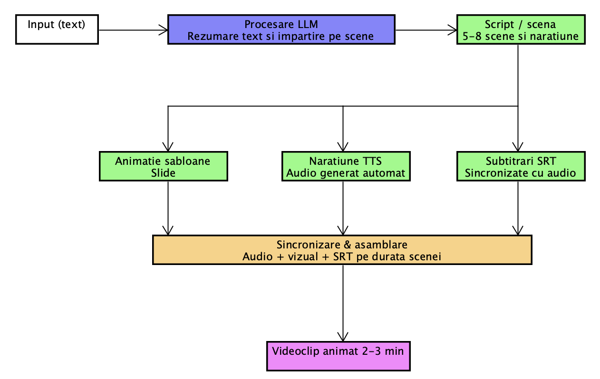

# Membrii echipei
Dușa Răzvan, Giosu Robert, Dumitrașcu Matei, Țilică Raul

### Descrierea problemei
Echipele de produse și educatorii au nevoie de o comunicare eficientă a ideilor complexe catre diverse audiențe. Materialele prin care să se comunice astfel de idei necesită timp semnificativ, competențe tehnice de design și editare video. Documentele text și prezentările statice au o rată scăzută de atenție din partea audienței.

### Soluție
Proiectul nostru propune un sistem inteligent bazat pe un LLM care automatizează întregul pipeline de la text la animație. 

### Model de utilizare
Utilizatorul introduce o descriere a unui produs sau a unui conținut educațional, iar sistemul generează automat:
- un script împărțit pe scene logice
- o animație bazată pe imagini corespunzătoare fiecărei scene
- o narațiune text-to-speech
- subtitrări sincronizate

Rezultatul este un videoclip care împachetează informația într-un format vizual și audio ușor de urmărit.
